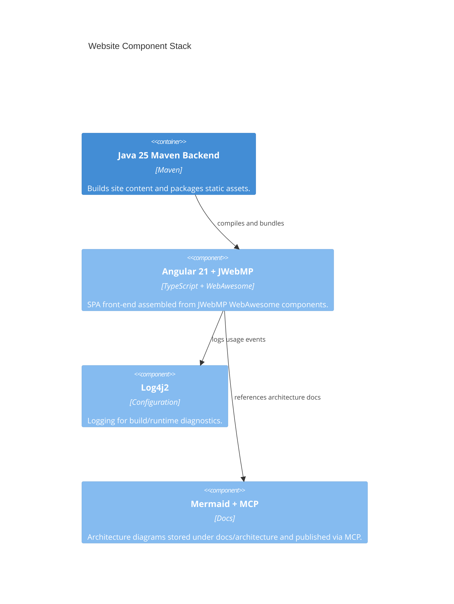

```mermaid
C4Component
    title Website Component Stack

    Container(backend, "Java 25 Maven Backend", "Maven", "Builds site content and packages static assets.")
    Component(webapp, "Angular 21 + JWebMP", "TypeScript + WebAwesome", "SPA front-end assembled from JWebMP WebAwesome components.")
    Component(logging, "Log4j2", "Configuration", "Logging for build/runtime diagnostics.")
    Component(diagrams, "Mermaid + MCP","Docs", "Architecture diagrams stored under docs/architecture and published via MCP.")

    Rel(webapp, logging, "logs usage events")
    Rel(webapp, diagrams, "references architecture docs")
    Rel(backend, webapp, "compiles and bundles")
```
