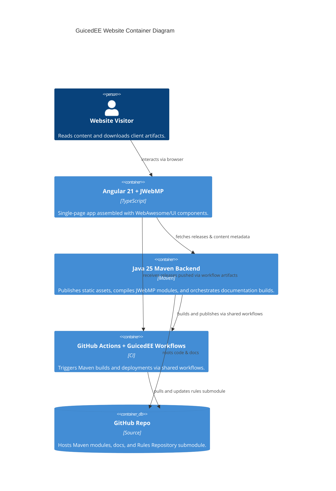

```mermaid
C4Container
    title GuicedEE Website Container Diagram

    Person(user, "Website Visitor", "Reads content and downloads client artifacts.")
    Container(spa, "Angular 21 + JWebMP", "TypeScript", "Single-page app assembled with WebAwesome/UI components.")
    Container(backend, "Java 25 Maven Backend", "Maven", "Publishes static assets, compiles JWebMP modules, and orchestrates documentation builds.")
    Container(ci, "GitHub Actions + GuicedEE Workflows", "CI", "Triggers Maven builds and deployments via shared workflows.")
    ContainerDb(scm, "GitHub Repo", "Source", "Hosts Maven modules, docs, and Rules Repository submodule.")

    Rel(user, spa, "interacts via browser")
    Rel(spa, backend, "fetches releases & content metadata")
    Rel(spa, ci, "receives releases pushed via workflow artifacts")
    Rel(backend, scm, "roots code & docs")
    Rel(ci, scm, "pulls and updates rules submodule")
    Rel(backend, ci, "builds and publishes via shared workflows")
```
