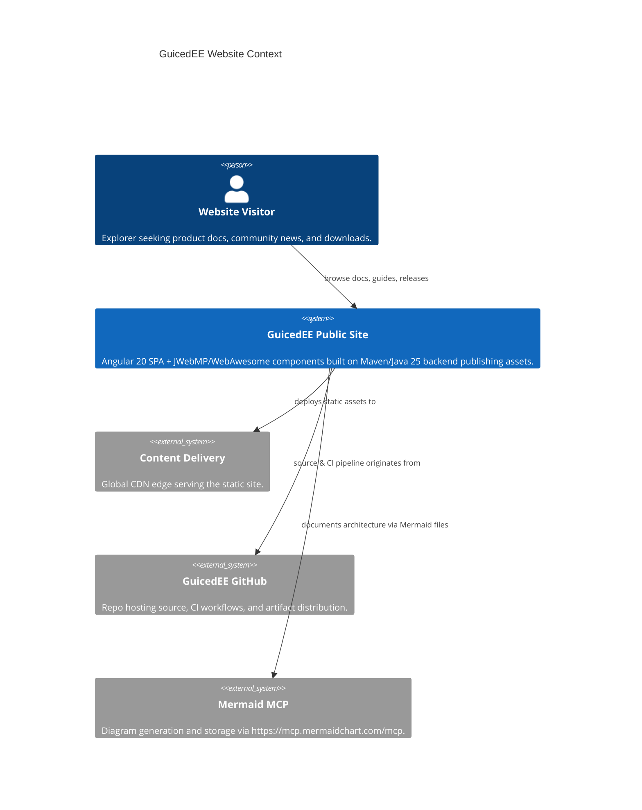

```mermaid
C4Context
    title GuicedEE Website Context

    Person(user, "Website Visitor", "Explorer seeking product docs, community news, and downloads.")
    System(website, "GuicedEE Public Site", "Angular 20 SPA + JWebMP/WebAwesome components built on Maven/Java 25 backend publishing assets.")
    System_Ext(nginx, "Content Delivery", "Global CDN edge serving the static site.")
    System_Ext(codehost, "GuicedEE GitHub", "Repo hosting source, CI workflows, and artifact distribution.")
    System_Ext(mcp, "Mermaid MCP", "Diagram generation and storage via https://mcp.mermaidchart.com/mcp.")

    Rel(user, website, "browse docs, guides, releases")
    Rel(website, nginx, "deploys static assets to")
    Rel(website, codehost, "source & CI pipeline originates from")
    Rel(website, mcp, "documents architecture via Mermaid files")
```
