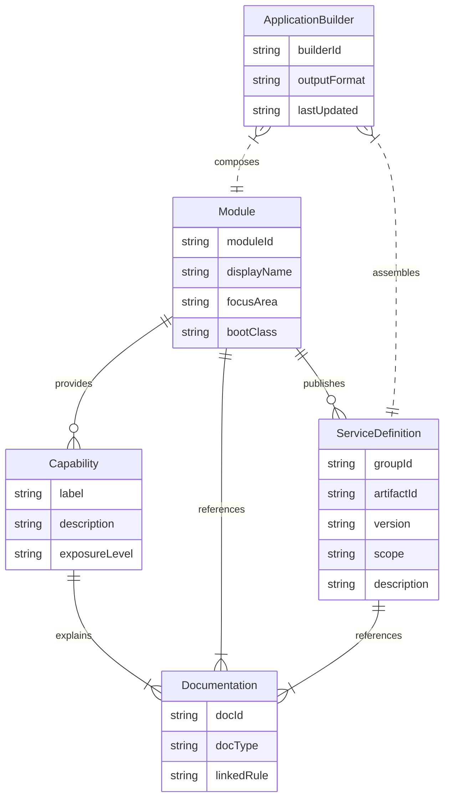

```mermaid
erDiagram
    Module {
        string moduleId
        string displayName
        string focusArea
        string bootClass
    }
    ServiceDefinition {
        string groupId
        string artifactId
        string version
        string scope
        string description
    }
    Capability {
        string label
        string description
        string exposureLevel
    }
    ApplicationBuilder {
        string builderId
        string outputFormat
        string lastUpdated
    }
    Documentation {
        string docId
        string docType
        string linkedRule
    }

    Module ||--o{ Capability : provides
    Module ||--o{ ServiceDefinition : publishes
    Capability ||--|{ Documentation : explains
    ApplicationBuilder }|..|| Module : composes
    ApplicationBuilder }|..|| ServiceDefinition : assembles
    Module ||--|{ Documentation : references
    ServiceDefinition ||--|{ Documentation : references
```
