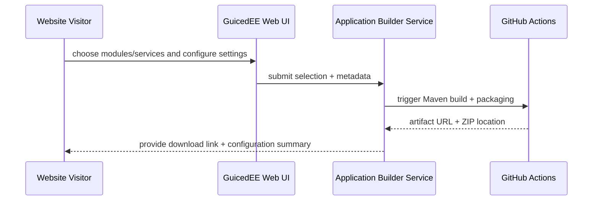

```mermaid
sequenceDiagram
    participant Visitor as Website Visitor
    participant SPA as GuicedEE Web UI
    participant Builder as Application Builder Service
    participant CI as GitHub Actions

    Visitor->>SPA: choose modules/services and configure settings
    SPA->>Builder: submit selection + metadata
    Builder->>CI: trigger Maven build + packaging
    CI-->>Builder: artifact URL + ZIP location
    Builder-->>Visitor: provide download link + configuration summary
```
