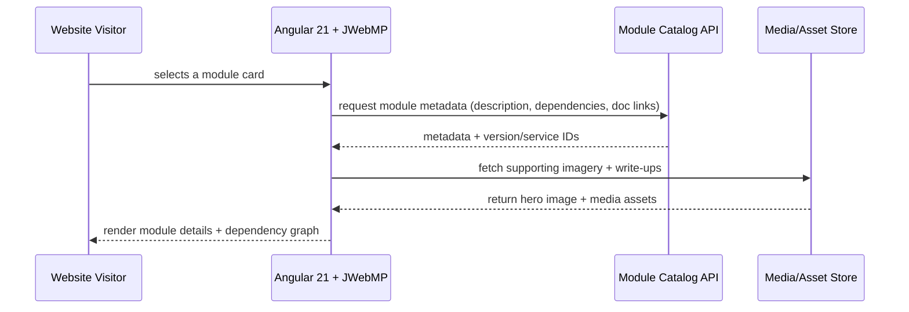

```mermaid
sequenceDiagram
    participant Visitor as Website Visitor
    participant SPA as Angular 21 + JWebMP
    participant Catalog as Module Catalog API
    participant Media as Media/Asset Store

    Visitor->>SPA: selects a module card
    SPA->>Catalog: request module metadata (description, dependencies, doc links)
    Catalog-->>SPA: metadata + version/service IDs
    SPA->>Media: fetch supporting imagery + write-ups
    Media-->>SPA: return hero image + media assets
    SPA-->>Visitor: render module details + dependency graph
```
