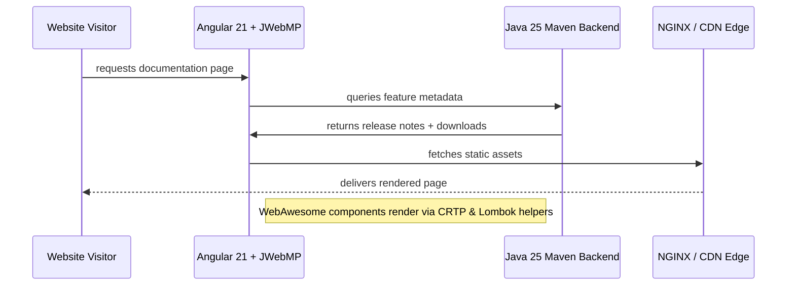

```mermaid
sequenceDiagram
    participant User as Website Visitor
    participant SPA as Angular 21 + JWebMP
    participant Backend as Java 25 Maven Backend
    participant CDN as NGINX / CDN Edge

    User->>SPA: requests documentation page
    SPA->>Backend: queries feature metadata
    Backend->>SPA: returns release notes + downloads
    SPA->>CDN: fetches static assets
    CDN-->>User: delivers rendered page
    Note right of SPA: WebAwesome components render via CRTP & Lombok helpers
```
